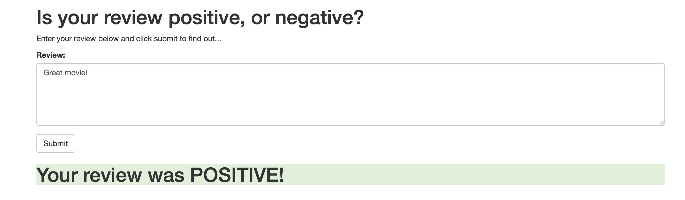
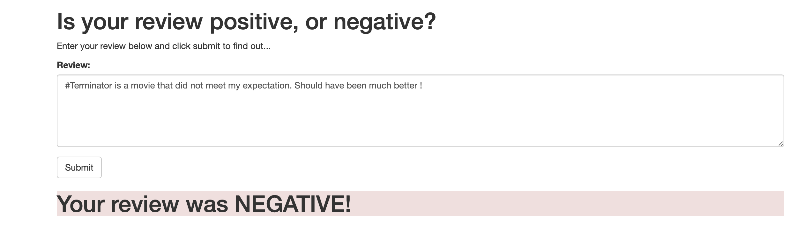

# Sentiment Analysis Model using Amazon's SageMaker

## Table of Contents

1. [Project Overview](#project_overview)
2. [Files Descriptions](#files_descriptions)
3. [Python Libraries](#python_libraries)
4. [Results Summary](#results_summary)
5. [License](#license)
6. [Acknowledgement](#acknowledgement)

## Project Overview
In this project a recurrent neural network is constructed for the purpose of determining the sentiment of a movie review using the IMDB data set. The model is created using Amazon's SageMaker service. In addition, the model is deployed and a simple web app is constructed which will interact with the deployed model. Following steps are carried out in the notebook for the execution of the project.
              
	       1.  Download or otherwise retrieve the data.
               2.  Process / Prepare the data.
               3.  Upload the processed data to S3.
               4.  Train a chosen model.
               5.  Test the trained model (typically using a batch transform job).
               6.  Deploy the trained model.
               7.  Use the deployed model.

## Files Descriptions

The enitre process adopted are carried out in one notebook and other supporting python scripts for the model deployment and web app.
    
        1.  SageMaker Project.ipynb: The main notebook for the exeution of the project .
        2.  train/train.py, train/model.py, and train/requirements.txt: python scripts and a text file to train the model
        3.  serve/model.py, serve/predict.py, serve/utils.py, and serve/requirements.txt: python scripts and text file to predict.
        4.  website/index.html: html file for web app
        
        The data files are explained in details in the notebook.

Step-by-step description of the entire process adopted in the project is explained in the file ** SageMaker Project.ipynb **.

## Python Libraries

The following python libraries are required to run the notebooks:
        
	> Amazon's AWS SageMaker: to build, train, and deploy the model
	> PyTorn: to build the LSTM classifier 
	> Others: Numpy, Scikit-learn, pandas, os, json, maths etc. (check the python scripts).
	> 

## Results Summary

I have used the LSTM from PyTorch to train the recurrent neural network model classifier and deploy the model with a web app using AWS SageMaker tool. The final web app and the results are shown below:

    1. Positive review predicted by the app.
        

    2. Negative review predicted by the app.
     

## License

## Acknowledgement
* We want to thank [Udacity](https://www.udacity.com/) for this project.

